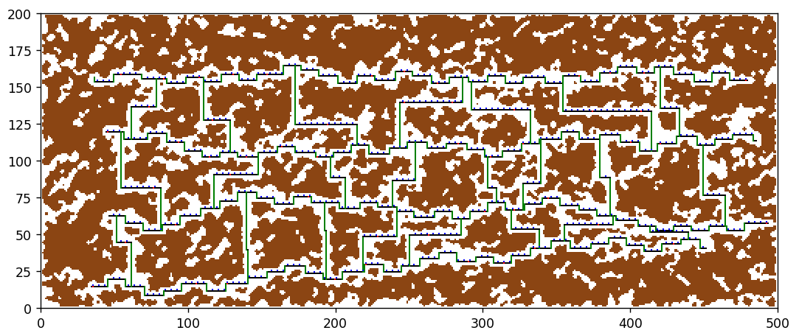
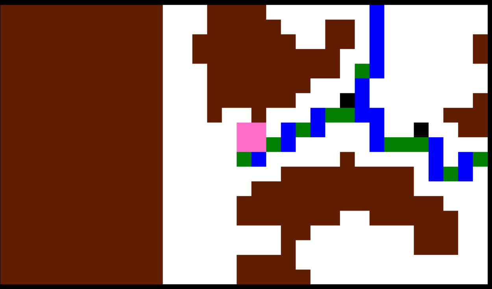

# Entelect Challenge 2023: CyFi 🏆

---
>### _NB:_ Game is a work in progress 🧑‍💻
>\
>Please note that the initial release is a **work in progress** 🔧 We will be making more patches later on to address some of the bugs. 🐛
>
>There is a super cool feature that is in the works, and will be released as soon as possible. 💪
>
>\
>As always please let us know if you find any bugs. We are open to all feedback.😊

---

## The Game

The game for Entelect Challenge 2023 is **Cy-Fi**, a sci-fi/cyberpunk/lo-fi themed
platformer. 🏃‍♀️

The world of Cy-Fi is broken into 4 procedurally generated dimensions.
Each dimension has its own theme, and its own spin on the world generation, with
each dimension getting larger.

The worlds are generated by first generating several routes (`paths`) through the map.

The map is then filled in with random noise to form cave-like structures,
ladders and paths are generated to form multiple pathways to traverse the level.
Collect reality distorting crystals (`Collectibles`) to get to the next level.

But watch out! There are other bots about! 

## Contents
- [Entelect Challenge 2023: CyFi 🏆](#entelect-challenge-2023-cyfi-)
  - [The Game](#the-game)
  - [Contents](#contents)
  - [General](#general)
  - [Rules](#rules)
  - [Game Ticks](#game-ticks)
  - [Heros](#heros)
  - [The Map](#the-map)
  - [Visibility](#visibility)
  - [Radar (WIP 🔧)](#radar-wip-)
  - [Game Objects](#game-objects)
  - [The Commands](#the-commands)
    - [Command: UP](#command-up)
    - [Command: Down](#command-down)
    - [Command: RIGHT/LEFT](#command-rightleft)
    - [Command: UPRIGHT/UPLEFT](#command-uprightupleft)
    - [Command: DOWNRIGHT/DOWNLEFT](#command-downrightdownleft)
    - [Command: DIGDOWN/DIGRIGHT/DIGLEFT](#command-digdowndigrightdigleft)
    - [STEAL](#steal)
  - [Command Structure](#command-structure)
  - [GAME TICK PAYLOAD](#game-tick-payload)
  - [ENDGAME](#endgame)
  - [SCORING](#scoring)

---

## General

📒 _Note: All configuration is subject to change while we are balancing. For the latest configurations please navigate to `2023-CyFi/CyFy` for `appsettings.json`, `appsessting.Development.json` and `appsettings.Production.json` changes still underway.\
Further configurations can be found in subfolder `Settings` 
where `GameSettings` and `MapSettings` live._

---
## Rules

In each level there will be several `Collectibles` for the heros(`bots`) to obtain. Once
the required number has been collected, the hero moves to the next `Level`.

There are four `Levels` in total. The first hero to acquire `Collectibles` in the final round wins. It's a race to the finish!

`Collectibles` available will reduce the higher the level.  

As soon as collectibles are grabbed by a hero, they are removed from the world, and unavailable to the other heros.

Heros can `Steal` `Collectibles` from other heros (WIP 🔧), the amount a hero can steal is proportional
to the number of collectibles the target hero has. Heros with more `Collectibles` cannot `Steal` from other heros with less - try and go for the heros with the most!

You can also `Dig` through the terrain, with a `Collectible` being rewarded after digging
a certain number of tiles.

---
## Game Ticks

CyFi is a real time game. It utilises `Ticks` a unit in time to keep track of the game


📒 _Note: only 3 commands are processed per tick. The slowest of the four heros to send their `command`, will have their `command` processed first in the next tick _

---

## Heros

Four Heros (`bots`) will be placed into the map together, and have to race to finish the game! Acquiring `Collectibles` will get you to the next `Level`. `Stealing`(WIP 🔧) is also legal!

## The Map

The world of Cy-Fi is broken into 4 procedurally generated dimensions. The four maps are generated from unique seeds.
Each dimension has its own theme, and its own spin on the world generation, with
each dimension getting larger.

The worlds are generated by first generating several "paths" through the map,
and are then filled in with random noise (`Solid`) to form cave-like structures,
which are then globbed together into solid walls.
Ladders and paths are generated to form multiple pathways to traverse the level.
Collectibles are then scattered around the map for the hero to collect and
hazards are placed for heros to avoid.

A generated image of the map: with `Solid` as "brown", and interconnecting horizontal line represent `paths`, vertical line `ladders` and the dots on the path represent `collectibles` "black" and `hazards` "red"



---

## Visibility

Heros can only see a limited amount of tiles in their view `16` above and below `10` tiles left and right

_A generated view of the Hero's point of view (`HeroWindow`):  hero(`bot`) "pink", `Solid` "brown", `Ladders` "blue", `Platforms` green, `Air` "white", `Collectibles` "black" and `Hazards` "red"_


## Radar (WIP 🔧)

_Work in progress_

## Game Objects

The map has the following tiles (pixels) :

- `Air` - 0 - Normal, open, breathable air.
- `Solid` - 1 - A solid object, the hero can only collide with this object. No interactions.
- `Collectible` - 2 - Collectibles are what you need to collect... just try to get the most.
- `Hazard` (WIP 🔧) - 3 - When the hero interacts with a hazard, a bad thing will happen. So... don't
- `Platform` - 4 - Normal, walkable platform.
- `Ladder` -  5 - Want to go up? Jump. Want to go higher? Use a ladder.
- `Opponent` (WIP 🔧) - 6 - opposing players on the map

--
## The Commands

Players may traverse the map via basic movement, `climbing` ,
and `jumping`. `Digging` will also clear out terrain (and give you `collectibles`!), so
you can use that to your advantage.


📒 _Note: A player has gravity and can therefore fall back to the ground if suspended in the `Air`.The player will stop falling when a `Solid`, `Platform` is encountered. Even though a player can fall. They cannot build momentum (speed) while falling or running. However while falling a player can still maneuver through `Air`_.


The Commands are as follows:

* `UP` - 1
* `DOWN`- 2
* `LEFT` - 3
* `RIGHT` - 4
* `UPLEFT` - 5
* `UPRIGHT` - 6
* `DOWNLEFT` - 7
* `DOWNRIGHT` - 8
* `DIGDOWN` - 9
* `DIGLEFT` - 10
* `DIGRIGHT` - 11
* `STEAL` - 12 (WIP 🔧)

### Command: UP

Allows the player to jump in open `Air` and on top of `Platforms` and, if manuevered correctly, cling to `Ladders`

Cannot jump when obstruction is encountered i.e `Solid`

---

### Command: Down

Allows the player to move one square down

---
### Command: RIGHT/LEFT

Allows the player to move one tile in either direction through `Air`, `Ladder`

Cannot move when obstructed by `Solid`

📒 _Note: Movement speed is fixed_

---

### Command: UPRIGHT/UPLEFT 

Allows player to jump diagonal in open `Air`, on to `Platforms` and more easily jump on to `Ladders`

Cannot move when obstructed by `Solid`

---
### Command: DOWNRIGHT/DOWNLEFT

Allows player to move diagonally down in open `Air`, on to `Platforms` and more easily jump on to `Ladders`

Cannot move when obstructed by `Solid`

---
### Command: DIGDOWN/DIGRIGHT/DIGLEFT


Players are able to dig through `Solid` in the specified directions

📒 _Note: Digging though a certain amount of solid will earn you a collectable!_

---
### STEAL

🔨  _Note: Apologies we are still working on it!_

---
## Command Structure

The command is sent with the following structure:

```jsonc
{
    "Action" : 1,                                   // UP action type - int
    "BotId" : "410d392c-ecf5-43b9-a228-299c0a8d224a" // destination node - string/UUID/GUID
}
```


## GAME TICK PAYLOAD
After every `Tick` the `runnerHub` will send a `BotStateDTO` response.

This will consist of the following values:
 - `CurrentLevel` - Current level your hero is on
 - `ConnectionId` - Your connectionId
 - `Collected` - Number of collectables your hero has collected
 - `ElapsedTime` - Time elapsed since game started
 - `HeroWindow` - The number of tiles a hero can view around themselves
 - `X` - Hero's current x position
 - `Y` - Hero's current y position

Example payload

```
Bot State DTO
currentLevel :      0
connectionId :      spxaVtkFvQg6rTZas_VEQg
collected:          1
elapsedTime:        -738627:6:15:28.4138411
hero Window:
                    [1, 1, 1, 1, 1, 1, 1, 1, 1, 1, 1, 1, 1, 1, 1, 1, 1, 1, 1, 1]
                    [1, 1, 1, 1, 1, 1, 1, 1, 1, 1, 1, 1, 1, 1, 1, 1, 1, 1, 1, 1]
                    [1, 1, 1, 1, 1, 1, 1, 1, 1, 1, 1, 1, 1, 1, 1, 1, 1, 1, 1, 1]
                    [1, 1, 1, 1, 1, 1, 1, 1, 1, 1, 1, 1, 1, 1, 1, 1, 1, 1, 1, 1]
                    [1, 1, 1, 1, 1, 1, 1, 1, 1, 1, 1, 1, 1, 1, 1, 1, 1, 1, 1, 1]
                    [1, 1, 1, 1, 1, 1, 1, 1, 1, 1, 1, 1, 1, 1, 1, 1, 1, 1, 1, 1]
                    [1, 1, 1, 1, 1, 1, 1, 1, 1, 1, 1, 1, 1, 1, 1, 1, 1, 1, 1, 1]
                    [1, 1, 1, 1, 1, 1, 1, 1, 1, 1, 1, 1, 1, 1, 1, 1, 1, 1, 1, 1]
                    [1, 1, 1, 1, 1, 1, 1, 1, 1, 1, 1, 1, 1, 1, 1, 1, 1, 1, 1, 1]
                    [1, 1, 1, 1, 1, 1, 1, 1, 1, 1, 1, 1, 1, 1, 1, 1, 1, 1, 1, 1]
                    [1, 1, 1, 1, 1, 1, 1, 1, 1, 1, 1, 1, 1, 1, 1, 1, 1, 1, 1, 1]
                    [1, 1, 1, 1, 1, 1, 1, 0, 0, 0, 0, 0, 0, 0, 0, 0, 0, 0, 0, 0]
                    [1, 1, 1, 1, 1, 1, 1, 0, 0, 0, 0, 0, 0, 0, 0, 0, 0, 0, 0, 0]
                    [1, 1, 1, 1, 1, 1, 1, 0, 0, 0, 0, 0, 0, 0, 0, 0, 0, 0, 0, 0]
                    [1, 1, 1, 1, 1, 1, 1, 0, 0, 0, 0, 0, 0, 0, 0, 0, 0, 0, 0, 0]
                    [1, 1, 1, 1, 1, 1, 1, 0, 0, 0, 0, 0, 0, 0, 0, 0, 0, 0, 0, 0]
                    [1, 1, 1, 1, 1, 1, 1, 0, 0, 4, 0, 0, 0, 0, 0, 0, 0, 1, 1, 1]
                    [1, 1, 1, 1, 1, 1, 1, 0, 0, 4, 0, 0, 0, 0, 0, 0, 0, 1, 1, 1]
                    [1, 1, 1, 1, 1, 1, 1, 0, 5, 5, 0, 0, 0, 0, 0, 0, 0, 0, 1, 1]
                    [1, 1, 1, 1, 1, 1, 1, 0, 4, 2, 0, 0, 0, 0, 0, 0, 0, 0, 1, 1]
                    [1, 1, 1, 1, 1, 1, 1, 0, 5, 5, 0, 0, 0, 0, 0, 0, 0, 0, 1, 1]
                    [1, 1, 1, 1, 1, 1, 1, 0, 0, 4, 2, 0, 0, 0, 0, 0, 0, 0, 0, 1]
                    [1, 1, 1, 1, 1, 1, 1, 0, 0, 5, 5, 0, 0, 0, 0, 0, 0, 0, 0, 1]
                    [1, 1, 1, 1, 1, 1, 1, 0, 0, 0, 5, 2, 5, 5, 5, 5, 4, 0, 0, 1]
                    [1, 1, 1, 1, 1, 1, 1, 0, 5, 5, 5, 0, 0, 0, 0, 0, 4, 0, 0, 1]
                    [1, 1, 1, 1, 1, 1, 1, 0, 4, 0, 0, 0, 0, 0, 0, 0, 4, 0, 0, 0]
                    [1, 1, 1, 1, 1, 1, 1, 0, 4, 0, 0, 0, 0, 0, 0, 0, 5, 5, 5, 5]
                    [1, 1, 1, 1, 1, 1, 1, 0, 4, 0, 0, 0, 0, 0, 0, 0, 0, 0, 0, 0]
                    [1, 1, 1, 1, 1, 1, 1, 0, 5, 5, 0, 0, 0, 0, 0, 0, 0, 0, 0, 0]
                    [1, 1, 1, 1, 1, 1, 1, 0, 0, 4, 0, 1, 1, 1, 0, 0, 0, 0, 0, 0]
                    [1, 1, 1, 1, 1, 1, 1, 0, 0, 4, 2, 1, 1, 1, 1, 0, 1, 1, 1, 0]
                    [1, 1, 1, 1, 1, 1, 1, 0, 0, 4, 0, 0, 1, 0, 0, 1, 1, 1, 1, 0]
                    [1, 1, 1, 1, 1, 1, 1, 0, 0, 5, 5, 0, 0, 0, 0, 0, 1, 1, 1, 0]

X:                  24
Y:                  12
```


📒 _Note: Your hero is not added to the `HeroWindow`. Since they are in they are in the center, they are easy to calculate.\
The hero takes up 4 tiles to make a square._

## ENDGAME
When a hero completes `level` 4, the game ends and that hero is the winner.

---

## SCORING 

Hero (`Bots`) get scores based on the amount of `collectibles` obtained. The hero that surpasses `level` four will gain extra points

---
